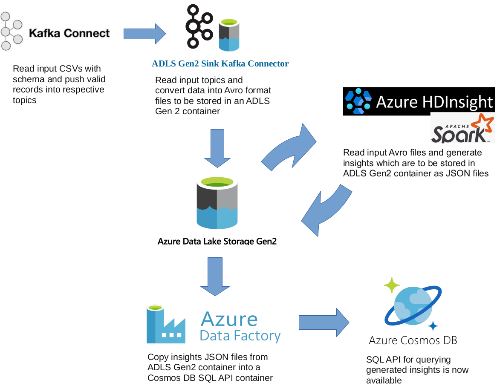

# YouTube Video Analytics using Spark, Azure and Kafka

### Project Description

YouTube uses few key factors like measuring user interactions; number of views, shares, comments,
and likes etc. to rank the videos as the top trending on the platform. The top trending list of videos
mostly belongs to movies, music, celebrities, reality shows, TV shows, etc. This dataset –
[USvideos.csv](src/main/resources/dataset/USvideos.csv) - includes a few years of daily trending YouTube videos.
The dataset [category_title.csv](src/main/resources/dataset/category_title.csv) has category_id field and corresponding title mapping.

### Objective

Use Spark on a cloud service to do exploratory analysis and extract actionable insights in a proper format with API for retrieval. Please note that the dataset is not available on the cloud service you'll use, thus it needs to be streamed to the cloud service.

Dataset:
* [USvideos.csv](src/main/resources/dataset/USvideos.csv)
* [category_title.csv](src/main/resources/dataset/category_title.csv)

Insights to be collected: [Insights.md](Insights.md)

### Solution Overview

1. We are going to use the [Confluent Platform](https://www.confluent.io/product/confluent-platform/) Community version and use [Kafka Connect](https://docs.confluent.io/3.0.1/connect/intro.html)’s
   [CSV Source Connector](https://docs.confluent.io/kafka-connect-spooldir/current/connectors/csv_source_connector.html) to read the CSV files and publish their data
   along with schema into their respective topics
2. With [ADLS Gen2 Sink Connector](https://docs.confluent.io/kafka-connect-azure-data-lake-gen2-sink/current/overview.html) as consumer, we’ll read data from the published topics
   and convert into Avro format files which are going to be stored in an ADLS Gen2 container
   named ‘topics’ created automatically by the connector
3. Our Scala based Spark application running on an Azure HDInsight Spark cluster will read
   the Avro data, generate insights and store the results as JSON files in ADLS Gen2 container.
   Intellij IDEA being our development IDE, it is convenient to use the [Azure Toolkit for
   Intellij](https://docs.microsoft.com/en-us/azure/hdinsight/spark/apache-spark-intellij-tool-plugin) to remotely run our application in the HDInsight cluster from within the IDE itself.
4. Finally, we’ll copy the insights JSON files from the ADLS Gen2 container into a Cosmos
   DB SQL API container using Azure Data Factory
5. The insights out of the YouTube videos analysis are now available for query using the
   Cosmos SQL API

### Detailed steps of the solution

Please check [solution_steps.pdf](solution_steps.pdf)

### License

GNU General Public License v3.0 or later

See [LICENSE.txt](LICENSE.txt) to see the full text.
